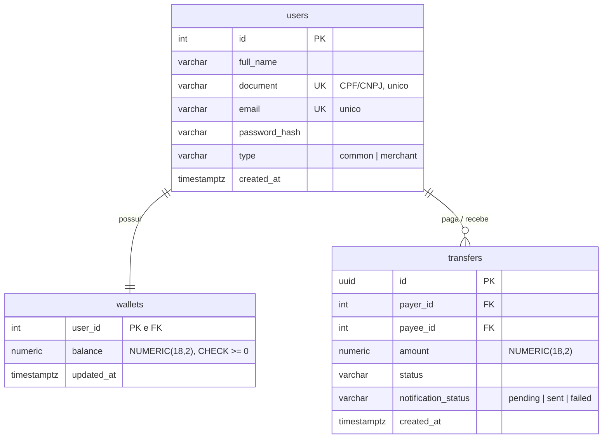

# API de Transferências · Desafio Appmax

API de transferências entre usuários com garantia de consistência de saldos sob concorrência e falhas de dependências externas.

**Stack:** Python 3.12 · FastAPI · PostgreSQL 16 · SQLAlchemy 2 · Docker Compose

## Índice

- [Como executar](#como-executar)
- [Como rodar os testes](#como-rodar-os-testes)
- [Arquitetura](#arquitetura)
- [Modelagem](#modelagem)
- [O fluxo da transferência](#o-fluxo-da-transferência)
- [Concorrência](#concorrência)
- [Integrações externas](#integrações-externas)
- [Códigos HTTP](#códigos-http)
- [Observabilidade](#observabilidade)
- [Trade-offs assumidos](#trade-offs-assumidos)
- [Limitações conhecidas](#limitações-conhecidas)
- [O que faria com mais tempo](#o-que-faria-com-mais-tempo)
- [Uso de IA](#uso-de-ia)

## Como executar

```bash
docker compose up --build
```

Só isso. O boot sobe o Postgres (com healthcheck), aplica as migrations, roda o seed idempotente e inicia a API em `http://localhost:8000`.

O payload de exemplo do enunciado funciona como está escrito, pois o seed cria os usuários 4 e 15:

```bash
curl -X POST http://localhost:8000/transfer \
  -H "Content-Type: application/json" \
  -d '{"value": 100.0, "payer": 4, "payee": 15}'
```

Outras formas de explorar:

| O quê | Onde |
|---|---|
| Documentação interativa (Swagger) | `http://localhost:8000/docs` |
| Health check (inclui conexão com o banco) | `GET /health` |
| Demonstração guiada dos cenários | `uv run python scripts/demo.py` |

A demonstração roda o contrato do enunciado e os cenários de recusa, mostrando os saldos antes e depois de cada um e o invariante da soma total.

Há também um painel ao vivo dos saldos (tabela que atualiza sozinha e destaca mudanças), útil para acompanhar transferências em tempo real:

```bash
uv run python scripts/watch_saldos.py
```

## Como rodar os testes

```bash
# suite completa (requer o Postgres do compose de pé)
docker compose up -d db
uv run pytest

# apenas unitários (sem banco, sem rede)
uv run pytest -m "not integration"

# lint
uv run ruff check .
```

Com `make`: `make up`, `make test`, `make test-unit`, `make lint`.

## Arquitetura

Monólito modular em camadas, proporcional ao escopo de 24h e sem overengineering:

```
app/
├── api/             # rotas FastAPI, schemas Pydantic, mapeamento exceção -> HTTP
├── application/     # use case da transferência + ports (contratos das dependências)
├── domain/          # regras de negócio, exceções, enums (sem banco, sem HTTP)
└── infrastructure/  # SQLAlchemy (repositórios, UnitOfWork) e clientes HTTP externos
```

Regras da separação:

- A rota não conhece SQL nem regra de negócio; o use case não conhece HTTP; o domínio não conhece nada além de si.
- As dependências apontam para dentro: a infraestrutura implementa contratos (`Protocol`) que a aplicação possui.
- Injeção de dependência por construtor, sem framework. O único lugar que constrói adapters concretos é o `main.py` (composition root).
- Os testes unitários rodam o use case inteiro com dublês em memória. É a prova prática de que a separação funciona.

## Modelagem



As quatro decisões da modelagem:

1. **Carteira separada do usuário.** O `SELECT FOR UPDATE` trava a linha inteira. Com a carteira em tabela própria, o lock da transferência atinge só o saldo, não o cadastro. `user_id` como PK e FK ao mesmo tempo torna a relação 1-para-1 inviolável no banco.
2. **Dinheiro nunca toca float.** `Decimal` na aplicação (o float do JSON é convertido já na borda, pelo Pydantic) e `NUMERIC(18,2)` no Postgres. A resposta devolve o valor como string (`"100.00"`) para o cliente também não ser empurrado a parse float.
3. **Constraints como defesa em profundidade.** `CHECK (balance >= 0)`, `CHECK (amount > 0)` e `CHECK (payer_id <> payee_id)`. Mesmo que a aplicação falhe, o banco não aceita estado inválido.
4. **Histórico atômico.** O registro em `transfers` nasce na mesma transação do débito e crédito. Não existe registro sem o dinheiro ter se movido, nem o contrário.

## O fluxo da transferência

```
1. Validações e pré-checagem de saldo        (sem transação longa, sem locks)
2. Autorizador externo                        (ANTES de qualquer lock)
3. Transação única:
   SELECT ... FOR UPDATE nas duas carteiras   (ordem determinística de user_id)
   revalida saldo -> debita -> credita -> INSERT transfer -> COMMIT
4. Notificação                                (DEPOIS do commit)
```

### A decisão mais difícil

Como garantir consistência sem segurar lock de banco esperando serviço externo? A resposta é o par "autoriza antes / revalida depois":

- O autorizador leva cerca de 1s por chamada e é consultado **antes** de abrir a transação. Se fosse dentro, cada transferência seguraria locks esperando rede, e latência de terceiro viraria contenção no banco.
- O custo é uma janela entre a autorização e o lock, na qual o mundo pode mudar. A **revalidação do saldo depois de adquirir o lock** cobre exatamente essa janela.

A notificação roda **depois** do commit e nunca reverte a transferência: o dinheiro moveu legitimamente. Se a falha da notificação virasse erro HTTP, o cliente reenviaria a requisição e o dinheiro sairia duas vezes.

## Concorrência

Cenário crítico: saldo 100, duas transferências simultâneas de 80.

- Com o `FOR UPDATE`, a segunda requisição bloqueia no `SELECT`. Quando adquire o lock, lê o saldo já commitado pela primeira (20) e é recusada.
- Exatamente uma conclui; a soma dos saldos é invariante.
- Os locks são adquiridos sempre em ordem crescente de `user_id` (`ORDER BY user_id FOR UPDATE`). Duas transferências em sentidos opostos disputam a mesma carteira primeiro, o que torna deadlock estruturalmente impossível.

O teste `tests/integration/test_concurrency.py` prova esse comportamento com Postgres real, duas threads sincronizadas por `Barrier` e sessões separadas. **Postgres real de propósito:** SQLite ignora `FOR UPDATE` silenciosamente e o teste passaria sem lock nenhum.

## Integrações externas

Antes de escrever os clientes, verifiquei empiricamente o comportamento dos endpoints. Os formatos observados estão nos docstrings dos clientes.

| Serviço | Comportamento real | Tratamento |
|---|---|---|
| Autorizador (`GET /authorize`) | Nega aleatoriamente com `403 + {"authorization": false}` | 3 resultados distintos: autorizado, negado (403 é resposta de negócio, não erro) e indisponível (timeout, 5xx, corpo inválido). Sem retry: negação é definitiva. |
| Notificador (`POST /notify`) | Falha aleatoriamente com 504 em ~1/3 das chamadas | Roda depois do commit, com 1 retry (~67% para ~89% de sucesso). Falha definitiva marca `notification_status = failed` e loga, sem mudar o 201. |

Na dúvida (indisponível), dinheiro não se move: a API responde 503 e nada é alterado no banco.

## Códigos HTTP

| Situação | Código | `code` no corpo |
|---|---|---|
| Transferência concluída | 201 | |
| Pagador/beneficiário inexistente | 404 | `USER_NOT_FOUND` |
| Lojista como pagador | 422 | `MERCHANT_CANNOT_TRANSFER` |
| Valor inválido / payer == payee | 422 | `INVALID_TRANSFER` |
| Saldo insuficiente | 409 | `INSUFFICIENT_BALANCE` |
| Negada pelo autorizador | 403 | `TRANSFER_NOT_AUTHORIZED` |
| Autorizador indisponível | 503 | `AUTHORIZER_UNAVAILABLE` |

Racional: 422 para regras sobre a própria requisição (independem de estado), 409 para conflito com o estado atual (pode funcionar amanhã), 403 reservado para a negação do autorizador.

## Observabilidade

- **Logs coloridos e unificados** (aplicação, uvicorn e chamadas externas no mesmo formato), com `NO_COLOR` respeitado.
- **Request ID por requisição**, propagado por contextvar até qualquer log do caminho e devolvido no header `X-Request-ID`. Sob concorrência, cada transferência tem sua história rastreável.
- **Uma linha de log por recusa de negócio** (código, status, path). Recusas são metade da história operacional.
- **`GET /health`** verifica também a conexão com o banco.

## Trade-offs assumidos

| Escolha | Alternativa rejeitada | Por quê |
|---|---|---|
| Saldo armazenado | Ledger (saldo por agregação de lançamentos) | Correto em fintech madura, mas complicaria lock e testes sem necessidade. O histórico em `transfers`, na mesma transação, preserva auditabilidade. |
| Notificação síncrona pós-commit | Fila (outbox + worker + broker) | Broker está explicitamente fora do escopo. A versão honesta de 24h: status persistido, retry limitado, log. |
| SQLAlchemy síncrono | Async | FastAPI roda rotas sync em threadpool. O fluxo transacional com locks fica mais simples de escrever, testar e explicar. O gargalo é o lock e a rede externa, não o modelo de I/O. |
| Registro apenas de transferências concluídas | Tabela de tentativas | Tentativas recusadas aparecem nos logs. Auditoria completa seria uma tabela à parte em produção. |

## Limitações conhecidas

- Sem autenticação/autorização de quem chama a API (fora do escopo do enunciado; a senha é armazenada com hash scrypt, mas não há login).
- Sem idempotência no `POST /transfer`: um retry do cliente após timeout pode duplicar a transferência.
- Validação de CPF/CNPJ apenas estrutural (unicidade), sem verificação de dígitos.
- Instância única; as migrations rodam no boot do container. Com múltiplas réplicas seria um job separado.
- Retry da notificação é limitado e síncrono; notificações `failed` ficam registradas mas não são reprocessadas.
- Credenciais de desenvolvimento no compose e porta 5432 exposta: aceitável para o desafio, jamais em produção.

## O que faria com mais tempo

1. **Idempotency-Key** no `POST /transfer`: chave única persistida + hash do payload (mesma chave com payload diferente é rejeitada). Protege contra duplicação quando o cliente não recebe a resposta.
2. **Transactional outbox + worker** para entrega confiável da notificação, com reprocessamento das `failed`.
3. Métricas (latência por fase, taxa de negação do autorizador) e logs estruturados em JSON.
4. Retry com backoff e circuit breaker no autorizador.
5. Validação real de CPF/CNPJ e rate limiting.

## Uso de IA

Usei IA (Claude) ao longo do desafio, com papéis diferentes por etapa:

- **Discussão de arquitetura:** cada decisão (modelagem, fluxo em 4 fases, estratégia de locks, tratamento das integrações, códigos HTTP) foi debatida etapa por etapa antes de virar código, incluindo a verificação empírica do comportamento real dos serviços externos.
- **Implementação:** geração de código sob as decisões já fechadas, com revisão minha.
- **Textos:** a primeira versão dos textos deste README e da documentação foi gerada por IA e revisada por mim.
- **Testes:** apoio no desenho dos casos de teste, testes exploratórios da API (rodando os cenários de erro contra a aplicação de pé) e uma revisão de segurança do código, que resultou em um ajuste real de validação (IDs limitados ao range do INTEGER já na borda, evitando 500 do driver).

As decisões finais de modelagem, ordem das operações, estratégia transacional e trade-offs documentados são minhas. O histórico de commits reflete a construção incremental.
