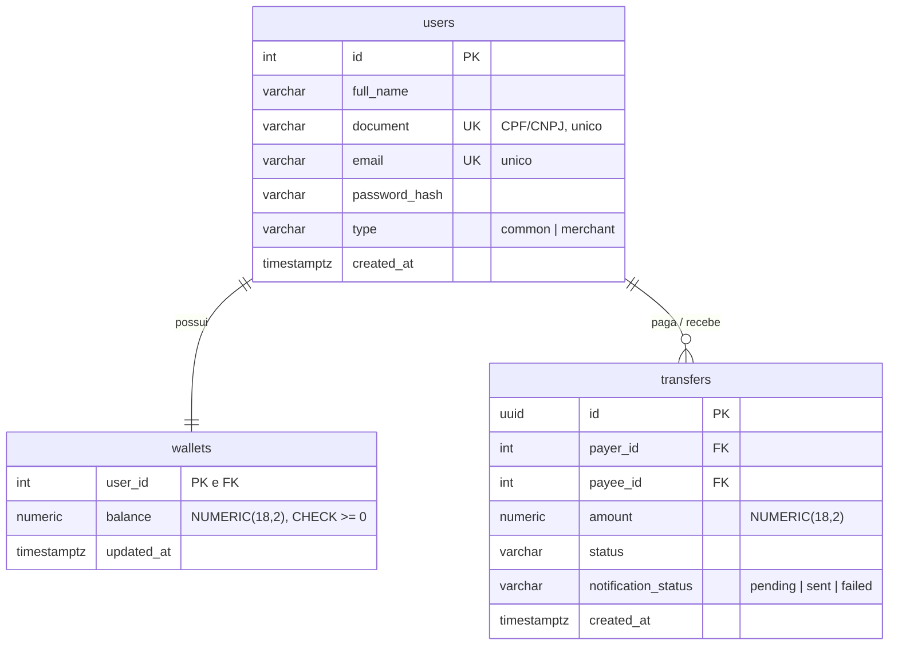

# API de Transferências — Desafio Appmax

API de transferências entre usuários com garantia de consistência de saldos sob concorrência e falhas de dependências externas.

## Como executar

```bash
docker compose up --build
```

Só isso. O boot sobe o Postgres (com healthcheck), aplica as migrations, roda o seed idempotente e inicia a API em `http://localhost:8000`.

O payload de exemplo do enunciado funciona como está escrito (o seed cria os usuários 4 e 15):

```bash
curl -X POST http://localhost:8000/transfer \
  -H "Content-Type: application/json" \
  -d '{"value": 100.0, "payer": 4, "payee": 15}'
```

Documentação interativa em `http://localhost:8000/docs`. Health check em `GET /health` (verifica também a conexão com o banco).

### Como rodar os testes

```bash
# suite completa (requer o Postgres do compose de pé)
docker compose up -d db
uv run pytest

# apenas unitários (sem banco, sem rede)
uv run pytest -m "not integration"

# lint
uv run ruff check .
```

Com `make`: `make up`, `make test`, `make test-unit`, `make lint`.

## Arquitetura

Monólito modular em camadas — proporcional ao escopo de 24h, sem overengineering:

```
app/
├── api/             # rotas FastAPI, schemas Pydantic, mapeamento exceção → HTTP
├── application/     # use case da transferência + ports (contratos das dependências)
├── domain/          # regras de negócio, exceções, enums — sem banco, sem HTTP
└── infrastructure/  # SQLAlchemy (repositórios, UnitOfWork) e clientes HTTP externos
```

A rota não conhece SQL nem regra de negócio; o use case não conhece HTTP; o domínio não conhece nada além de si. Os testes unitários rodam o use case inteiro com dublês em memória — a prova prática de que a separação funciona.

### Modelagem



- **Carteira separada do usuário**: o `SELECT FOR UPDATE` trava a linha inteira; com a carteira separada, o lock da transferência atinge só o saldo, não o cadastro. `user_id` como PK+FK torna a relação 1-para-1 inviolável no banco.
- **Dinheiro nunca toca float**: `Decimal` na aplicação (convertido já na borda pelo Pydantic), `NUMERIC(18,2)` no Postgres.
- **Constraints como defesa em profundidade**: `CHECK (balance >= 0)`, `CHECK (amount > 0)`, `CHECK (payer_id <> payee_id)` — mesmo que a aplicação falhe, o banco não aceita estado inválido.
- **`transfers` nasce na mesma transação do débito/crédito**: não existe registro sem o dinheiro ter se movido, nem o contrário.

## Principais decisões

### O fluxo da transferência em 4 fases

```
1. Validações e pré-checagem de saldo        (sem transação longa, sem locks)
2. Autorizador externo                        (ANTES de qualquer lock)
3. Transação única:
   SELECT ... FOR UPDATE nas duas carteiras   (ordem determinística de user_id)
   revalida saldo → debita → credita → INSERT transfer → COMMIT
4. Notificação                                (DEPOIS do commit)
```

**A decisão mais difícil do projeto**: como garantir consistência sem segurar lock de banco esperando serviço externo. A resposta é o par "autoriza antes / revalida depois":

- O autorizador (~1s de latência) é consultado **antes** de abrir a transação. Se fosse dentro, cada transferência seguraria locks esperando rede — latência de terceiro viraria contenção no banco.
- O custo é uma janela entre a autorização e o lock em que o mundo pode mudar. A **revalidação do saldo depois de adquirir o lock** cobre exatamente essa janela.

### Concorrência

Cenário crítico: saldo 100, duas transferências simultâneas de 80. Com o `FOR UPDATE`, a segunda requisição bloqueia no `SELECT`, e quando adquire o lock lê o saldo **já commitado** pela primeira (20) — e é recusada. Exatamente uma conclui; a soma dos saldos é invariante.

Os locks são adquiridos **sempre em ordem crescente de `user_id`** (`ORDER BY user_id FOR UPDATE`). Duas transferências em sentidos opostos (A→B e B→A) tentam travar a mesma carteira primeiro — deadlock estruturalmente impossível.

O teste de integração `tests/integration/test_concurrency.py` prova esse comportamento com Postgres real, duas threads sincronizadas por `Barrier` e sessões separadas. **Postgres real de propósito**: SQLite ignora `FOR UPDATE` silenciosamente — o teste passaria sem lock nenhum.

### Integrações externas

Antes de escrever os clientes, verifiquei empiricamente o comportamento dos endpoints (os formatos estão documentados nos docstrings dos clientes):

- **Autorizador** (`GET .../authorize`): nega aleatoriamente com `403 + {"data": {"authorization": false}}`. O cliente distingue três resultados: **autorizado**, **negado** (403 é resposta de negócio, não erro) e **indisponível** (timeout, 5xx, corpo inválido — não sabemos a resposta e, na dúvida, dinheiro não se move → HTTP 503). Sem retry: negação é resposta definitiva.
- **Notificador** (`POST .../notify`): falha aleatoriamente com 504 em ~1/3 das chamadas. Roda **depois do commit** com 1 retry (~67% → ~89% de sucesso). Falha definitiva marca `notification_status = failed` e loga — **nunca reverte a transferência** (o dinheiro moveu legitimamente) e **não muda o 201** (um erro aqui faria o cliente reenviar e duplicar a transferência).

### Códigos HTTP

| Situação | Código | `code` no corpo |
|---|---|---|
| Transferência concluída | 201 | — |
| Pagador/beneficiário inexistente | 404 | `USER_NOT_FOUND` |
| Lojista como pagador | 422 | `MERCHANT_CANNOT_TRANSFER` |
| Valor inválido / payer == payee | 422 | `INVALID_TRANSFER` |
| Saldo insuficiente | 409 | `INSUFFICIENT_BALANCE` |
| Negada pelo autorizador | 403 | `TRANSFER_NOT_AUTHORIZED` |
| Autorizador indisponível | 503 | `AUTHORIZER_UNAVAILABLE` |

422 para regras sobre a própria requisição (independem de estado), 409 para conflito com o estado atual (pode funcionar amanhã), 403 reservado para a negação do autorizador.

### Bibliotecas

- **SQLAlchemy 2 (síncrono) + psycopg 3**: controle explícito de transação, lock e commit — o coração do desafio fica visível no código, não escondido. FastAPI roda rotas síncronas em threadpool; async não traria ganho que justificasse a complexidade extra aqui.
- **httpx** (timeout explícito de 5s), **Alembic** (migrations), **pydantic-settings** (config 12-factor), **pytest + respx** (mock de HTTP sem rede), **ruff** (lint/format), **uv** (dependências com lockfile).

## Trade-offs assumidos

- **Saldo armazenado vs. ledger**: um livro-razão (saldo = agregação de lançamentos) é o modelo contábil clássico, mas complicaria lock, testes e explicação sem necessidade neste escopo. O histórico em `transfers`, criado na mesma transação, preserva auditabilidade — e o teste de concorrência prova a invariante da soma.
- **Notificação síncrona pós-commit vs. fila**: entrega garantida exigiria transactional outbox + worker + broker — broker está explicitamente fora do escopo. A versão honesta de 24h: status persistido (`pending/sent/failed`) + retry limitado + log.
- **Autorização antes da transação**: descrito acima; a janela é coberta pela revalidação pós-lock.
- **Registro apenas de transferências concluídas**: tentativas recusadas aparecem nos logs, não no banco. Auditoria completa de tentativas seria uma tabela à parte em produção.

## Limitações conhecidas

- Sem autenticação/autorização de quem chama a API (fora do escopo do enunciado; a senha é armazenada com hash scrypt, mas não há login).
- Sem idempotência no `POST /transfer`: um retry do cliente após timeout pode duplicar a transferência (ver "com mais tempo").
- Validação de CPF/CNPJ apenas estrutural (unicidade), sem verificação de dígitos.
- Instância única; as migrations rodam no boot do container — com múltiplas réplicas seria um job separado.
- Retry da notificação é limitado e síncrono; notificações `failed` ficam registradas mas não são reprocessadas.

## O que faria com mais tempo

1. **Idempotency-Key** no `POST /transfer`: chave única persistida + hash do payload (mesma chave com payload diferente → rejeitada). Protege contra duplicação quando o cliente não recebe a resposta.
2. **Transactional outbox + worker** para entrega confiável da notificação, com reprocessamento das `failed`.
3. Métricas (latência por fase, taxa de negação do autorizador) e logs estruturados em JSON.
4. Retry com backoff + circuit breaker no autorizador.
5. Validação real de CPF/CNPJ e rate limiting.

## Uso de IA

Usei IA (Claude) de forma estruturada ao longo do desafio:

- **Como par de discussão**: cada decisão de arquitetura (modelagem, fluxo em 4 fases, estratégia de locks, tratamento das integrações, códigos HTTP) foi discutida etapa por etapa antes de virar código — inclusive com verificação empírica do comportamento real dos endpoints externos antes de desenhar os clientes.
- **Na implementação**: geração de código sob as decisões já tomadas, testes e documentação, com revisão minha.

As decisões finais — modelagem em três tabelas, ordem das operações (autorizar antes da transação, revalidar após o lock, notificar após o commit), locks em ordem determinística, semântica dos códigos HTTP e os trade-offs documentados acima — foram escolhas que discuti, entendi e assumo. O histórico de commits reflete a construção incremental.
